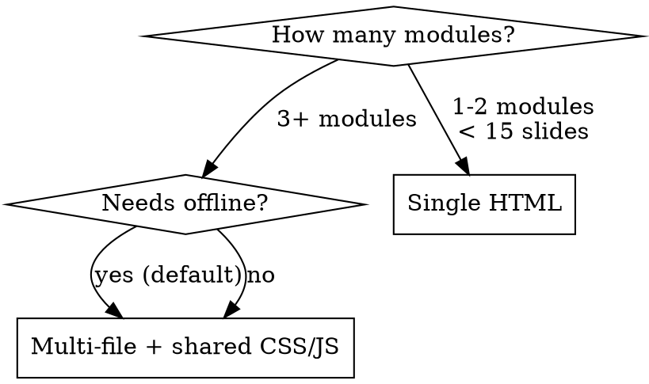

# Presentation as Code

## Overview

Create high-impact, interactive HTML presentations by treating slides like code: modular architecture, shared design system, data-driven narrative, iterative refinement. Output is standalone HTML files that work offline, look professional, and tell a compelling story.

**Core principle:** Content architecture first, visual design second, interactivity third. Never start with how it looks — start with what story it tells and why the audience should care.

**IMPORTANT: Before starting any presentation work, read `constitution.md` in this skill directory. It defines the non-negotiable rules for all presentation decisions. Every slide must pass the constitution's checklist before being shown to the user.**

## When to Use

- Creating training materials for non-technical audiences
- Building interactive slide decks or tech talks
- Making pitch presentations with data visualization
- Any visual storytelling that needs to go beyond PowerPoint

**When NOT to use:**
- Quick internal docs (use markdown)
- Formal reports (use PDF/Word)
- Presentations under 5 slides (overkill)

## Architecture Decision



**Always prefer multi-file.** We tried single-file (71KB Reveal.js monolith) and it failed: unmaintainable, rendering issues, CDN dependency.

### Proven Architecture

```
presentation-name/
  00-opening.html      # Each module = standalone HTML
  01-topic-a.html
  02-topic-b.html
  ...
  style.css            # Shared design system
  slides.js            # Shared navigation (scroll-snap + keyboard)
```

**Why standalone HTML per module:**
- Each file independently loadable (no build step)
- Offline-first (no CDN dependency)
- Parallel development (edit one module without touching others)
- Easy to reorder, add, or remove modules

## The Five Phases

### Phase 1: Narrative Architecture (DO THIS FIRST)

**Goal:** Design the story arc before touching any HTML.

```
Audience → Pain Point → Demystification → Tools → Mastery → Action
```

**Checklist:**
- [ ] Define audience persona (role, tech level, concerns)
- [ ] Design 3-5 module arc with clear emotional progression
- [ ] Each module has ONE "remember this" anchor
- [ ] Opening uses DATA not claims (numbers → urgency)
- [ ] Closing uses PERSONAL PRACTICE not abstract future

**Proven narrative patterns:**

| Module Position | Purpose | Technique |
|---|---|---|
| Opening | Create urgency | Industry data, speed comparisons, trend charts |
| Module 1 | Remove fear | Analogy to familiar experience (e.g., "LLM = autocomplete") |
| Module 2-3 | Build capability | Live demos > screenshots > text descriptions |
| Closing | Drive action | "Here's what I actually do" > "Here's what you could do" |

**Anti-pattern:** Starting with "What is AI" → boring, condescending. Start with "Why should YOU care RIGHT NOW."

### Phase 2: Design System

**Goal:** Establish visual language before writing content HTML.

**The CSS Variable Foundation:**

```css
:root {
  /* Accent palette — one color per module for identity */
  --accent-blue: #4f6df5;
  --accent-purple: #7c3aed;
  --accent-green: #10b981;
  --accent-orange: #f59e0b;
  --accent-red: #ef4444;
  --accent-pink: #db2777;

  /* Typography */
  --heading: #1a202c;
  --text: #2d3748;
  --text-muted: #718096;
  --bg: #ffffff;
}
```

**Component Library (proven patterns):**

| Component | Use Case | Key Styling |
|---|---|---|
| `.tag.tag-N` | Module identifier | Colored pill badge, top of each slide |
| `.card` | Information blocks | White bg, left/top border accent, subtle shadow |
| `.highlight-box` | Key takeaway | Colored bg + left border, bold text |
| `.quote-box` | Citations/quotes | Italic, attribution in muted text |
| `.badge` | Inline labels | Small colored pill, used for tools/skills |
| `.bar-chart` | Horizontal comparison | Custom bars with gradient fills, labels |
| `.flow` | Sequential steps | Flexbox with arrow dividers |
| `.card-grid.cols-N` | Multi-column layout | CSS grid, responsive columns |

**Typography:** Use `Noto Sans SC` for Chinese content (weights 300-900). For English-only, consider Inter or system fonts.

**Visual emphasis hierarchy:**
1. Gradient text (`background-clip: text`) — for slide titles, ONE per slide max
2. Colored accent borders — for cards and highlight boxes
3. Bold + color — for inline emphasis
4. Size contrast — large numbers (3.2em) for key metrics
5. Muted text — for supporting context

**Anti-pattern:** Glassmorphism or blur effects everywhere → distracting. Use subtle transparency (`rgba(X,X,X,0.06)`) for depth, not decoration.

### Phase 3: Content Construction

**Per-slide structure:**

```html
<section class="slide">
  <span class="tag tag-N">Module Label</span>
  <h2>Title with <span class="gradient">Accent</span></h2>
  <p class="text-muted">One-line context</p>
  <!-- Content: cards, charts, comparisons -->
  <div class="highlight-box">
    <strong>Key takeaway of this slide</strong>
  </div>
</section>
```

**Data visualization priority:**
1. **Chart.js** — for trend lines, comparisons with annotations
2. **Custom bar charts** — HTML/CSS horizontal bars with gradient fills
3. **SVG animations** — for conceptual diagrams (network, flow)
4. **Phone/terminal mockups** — for demonstrating familiar interfaces
5. **Tables with traffic-light colors** — for decision matrices

**Navigation system (`slides.js`):**
- Scroll-snap based (not page-flip)
- Keyboard: arrows, space, Home/End
- Progress bar + slide counter
- IntersectionObserver for automatic position tracking

### Phase 4: Interactive Layer

**Add interactivity AFTER static content is solid.**

| Element | Technique | When to Use |
|---|---|---|
| Chart animation | Chart.js with custom tooltip | Trend data, cost curves |
| SVG particle flow | `<animateMotion>` + `<animate>` | Network/relationship diagrams |
| Phone mockup | CSS-only with fake status bar | Demonstrating familiar UX analogies |
| Terminal mockup | Dark div with monospace + colored spans | Showing technical concepts accessibly |
| Live demo | Claude Code in presentation | "Build X in 90 seconds" moments |

**Live demo protocol:**
1. Prepare the exact prompt in DEMO-CHEATSHEET.md
2. Pre-generate a backup HTML file
3. If network fails → switch to backup seamlessly
4. Demo should be ≤90 seconds and produce visible output

### Phase 5: Polish & Stress Test

- [ ] Open each module in browser, scroll through entirely
- [ ] Test offline (disconnect network, reload)
- [ ] Test keyboard navigation (all shortcuts work)
- [ ] Check mobile rendering (responsive grids collapse correctly)
- [ ] Read aloud — does the narrative flow naturally?
- [ ] "Grandma test" — would a non-tech person understand each slide?

## Visual Balance Rules (MANDATORY — from real user feedback)

These rules were learned through painful iteration on a 30-slide TED Talk presentation. Every one of them was a real mistake that got called out. **Check EVERY slide against these before declaring done.**

### Rule 1: Line Length Balance
**【高频犯错】任何超过 15 个中文字符的句子，必须手动用 `<br>` 在语义断点处分行。**
- 不能靠破折号（——）或标点来"暗示"换行——浏览器不认
- 上半句是铺垫/前提，下半句是结论/重点
- 相邻两行长度必须大致相等，不能一行 20 字一行 5 字
- 每次写完一段文字后必须检查：投影上渲染会不会在尴尬位置断行？

**Bad:** `定目标、定规则、选阵容<br>让 AI 之间互相卷` (第一行 9 字，第二行 8 字但视觉宽度差异大)
**Good:** `定目标 · 定规则<br>选阵容 · 让它们互相卷`

### Rule 2: Dual-Column Balance
双栏布局中两栏的视觉高度必须大致相等。如果一栏内容远多于另一栏，**宁可口头补充，不要硬塞破坏平衡**。

**Bad:** 左栏 4 个 card，右栏 1 个数字面板 → 严重头重脚轻
**Good:** 左栏 2 个 card，右栏 1 个面板 + badge 组 → 视觉均衡

### Rule 3: Information Density per Slide
一页只传递一个视觉主体。当你发现一页有两层以上嵌套结构（卡片里套 badge 里套文字），**必须停下来砍**。

**Bad:** 痛点卡片（内含 badge 列表）+ 对比条（内含子标题 + 说明）+ 金句 = 三层
**Good:** 简洁 VS 对比 + 一句收束 = 一层主体

### Rule 4: Background Color Discipline
以白色为主（~80% 的页面）。暗色/彩色**只用在真正的结构转折点**：
- 封面、核心论点、章节总结、收尾 → 可以用暗色
- 其余全部白底
- **绝对不要连续两页不同背景色来回跳**——视觉混乱

### Rule 5: Subtitle Hierarchy
卡片/模块的子标题用 `<h3>` 不用 `<p style="font-size:0.8em">`。子标题需要跟正文有明显的视觉层级差异（字号 + 字重），缩小字号反而让子标题看起来像注释。

### Rule 6: Screenshot Sizing
截图必须足够大让人看清内容。手机截图 ≥ 50vh，横屏截图 width ≥ 80%。如果截图太多放不下，**拆成多页而不是缩小截图**。

### Rule 7: Card Text Alignment
同一组 card 内的文字行数应尽量一致。如果一个 card 一行字，另一个 card 三行字，视觉上不对称。解法：用 `<br>` 统一行数，或精简长的那个。

### Rule 8: Flow/Timeline Readability
flow 步骤中的文字必须短（≤6 个字）。如果描述复杂，把细节放在下方说明区，flow 里只放关键词。

---

## Common Mistakes & Fixes

| Mistake | Why It Fails | Fix |
|---|---|---|
| Reveal.js / framework dependency | CDN offline = white screen | Standalone HTML + local CSS/JS |
| Single giant file | Unmaintainable past 30 slides | One file per module |
| Dark theme for non-tech audience | Feels "programmer-ish", intimidating | White base + color accents |
| Text walls on slides | Audience reads ahead, ignores speaker | Data viz + one takeaway per slide |
| Too many animations | Distracts from content | Animate only key data points |
| Starting with "What is X" | Boring, condescending | Start with "Why should you care" |
| Ending with "future trends" | Abstract, no action | End with "what I actually do" |
| CDN fonts/scripts | Offline fragility | Self-host or use system fonts |
| Unbalanced line breaks | Text wraps at ugly positions on projector | Manual `<br>` at semantic breakpoints |
| Frequent bg color switching | Visual chaos, audience gets dizzy | White base, dark only at structural turns |
| Cramming 3+ ideas per slide | Audience retains nothing | One visual subject per slide |
| Tiny screenshots | Audience can't read, wasted evidence | ≥50vh for phone, ≥80% width for landscape |
| Spoiling conclusion in subtitle | Kills narrative tension | Title = question/hook, save answer for next slide |

## Checklist: Before Declaring Done

- [ ] Each module loads independently in browser
- [ ] Works fully offline (no CDN dependency)
- [ ] Keyboard navigation functional (←→↑↓ Space Home End)
- [ ] Progress bar updates correctly
- [ ] Mobile responsive (test at 768px width)
- [ ] One gradient-text title per slide (not more)
- [ ] Every slide has a highlight-box or clear takeaway
- [ ] Opening slide has data, not claims
- [ ] Closing slide has personal practice, not abstract vision
- [ ] DEMO-CHEATSHEET.md prepared with backup plan
- [ ] All inter-module navigation links work (← previous / next →)

## Real-World Impact

This methodology produced a 5-module, 35+ slide interactive training for 40 legal professionals with zero coding background. Key metrics:
- 12-day development cycle (content → design → polish)
- 6 standalone HTML files, fully offline
- Shared design system: 1 CSS (21KB) + 1 JS (77 lines)
- 4 types of data visualization per module average
- Live Claude Code demo embedded in presentation flow
